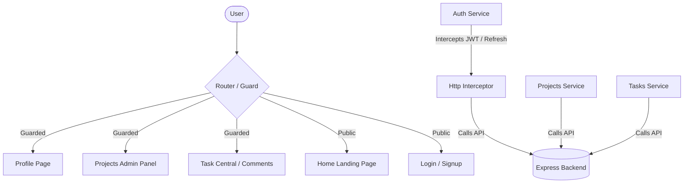

<p align="center">
  
</p>
<h1 align="center">LearnLoop Frontend</h1>


LearnLoop is a modern, premium, and feature-rich Project and Task Collaboration platform designed to help teams collaborate efficiently. This directory contains the frontend web application, built with **Angular v20**, **Tailwind CSS v4**, and custom design system primitives.

---

## 🌟 Key Features

- **📂 Project Administration**: Admin users can create, view, modify, and manage projects, setting due dates and coordinating team members.
- **📋 Task Central**: Assign tasks to projects, set status indicators (`To Do`, `In Progress`, `Done`), add detailed descriptions, and track due dates.
- **📎 Task Attachments**: Upload and download project assets and documents directly within the specific tasks.
- **💬 Real-Time Comments**: Discuss task implementation details and updates directly on tasks to foster team alignment.
- **👤 User Profiles**: Dynamic profile management enabling users to view stats, update credentials, and check active projects.
- **🛡️ Secure JWT Routing**: Custom routing guards (`AuthGuard`) and token refresh interceptors (`AuthInterceptor`) ensuring a secure, seamless user session.
- **🎨 Premium Modern Design**: Elegant user interface leveraging Tailwind CSS v4, smooth micro-animations, glassmorphic headers, responsive layouts, and interactive dark/light theme triggers.

---

## 🛠️ Architecture & Directory Structure

The Angular frontend is structured to promote separation of concerns, reusability, and modularity:

```
Frontend/
├── src/
│   ├── app/
│   │   ├── components/
│   │   │   ├── ui/             # Reusable UI primitives (Buttons, Cards, Inputs, Alerts)
│   │   │   ├── projects/       # Project list, details, and creation forms
│   │   │   ├── tasks/          # Task management table, forms, and attachments
│   │   │   ├── profile/        # User profile page
│   │   │   ├── home/           # Landing page / Hero section
│   │   │   ├── navbar/         # Responsive navigation header
│   │   │   └── toast.component/ # Custom notification toast UI
│   │   ├── services/           # Core API connectors (Auth, Projects, Tasks, Users)
│   │   ├── models/             # Type-safe TypeScript interfaces for entities
│   │   └── app.routes.ts       # Application routing configurations
│   ├── environments/           # Configuration keys (API endpoint urls)
│   └── styles.css              # Custom base styling and design variables
```

### Application Flow & Services Diagram



---

## ⚙️ Development Stack

- **Framework**: [Angular v20](https://angular.dev/) (standalone components & reactive signals structure)
- **Styling**: [Tailwind CSS v4](https://tailwindcss.com/) & PostCSS
- **Icons**: [Lucide Angular](https://lucide.dev/) & [FontAwesome v7](https://fontawesome.com/)
- **State & Utilities**: RxJS, Zod Validation, SweetAlert2, and ngx-toastr
- **Development Tooling**: PostCSS utilities, ESLint, TypeScript v5.9, and Karma/Jasmine testing framework

---

## 🚀 Getting Started

### 📋 Prerequisites

Make sure you have the following tools installed on your local machine:
- **Node.js** (v18 or higher recommended)
- **npm** (v9 or higher)
- **Angular CLI** (`npm install -g @angular/cli`)

### 🛠️ Setup Instructions

1. **Navigate to the frontend directory**:
   ```bash
   cd Frontend
   ```

2. **Install dependencies**:
   ```bash
   npm install
   ```

3. **Configure Environment Variables**:
   Under `src/environments/environment.ts`, confirm that the `apiUrl` points to your running backend instance:
   ```typescript
   export const environment = {
       production: false,
       apiUrl: 'http://localhost:3000' // Target Backend Address
   };
   ```

4. **Start the development server**:
   ```bash
   npm run start
   ```
   Or use the Angular CLI command directly:
   ```bash
   ng serve
   ```

5. **Access the application**:
   Open [http://localhost:4200/](http://localhost:4200/) in your web browser.

---

## 🧪 Testing & Building

### Running Unit Tests
Execute unit tests using the Karma runner:
```bash
npm run test
```

### Production Build
Compile the application and output optimized production-ready bundle files to the `dist/` directory:
```bash
npm run build
```

---

## 📄 License
This project is private and proprietary. All rights reserved.
