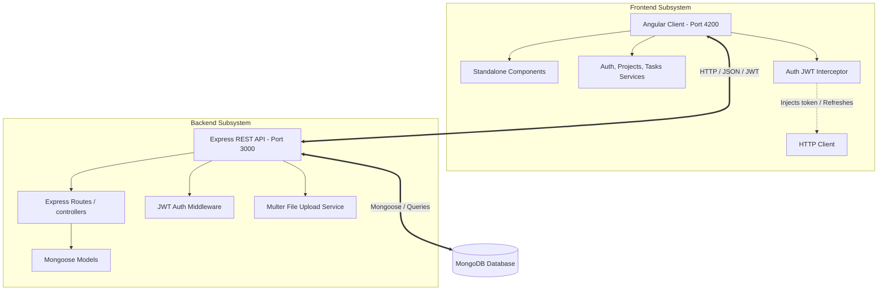

<p align="center">
  
</p>
<h1 align="center">LearnLoop</h1>


<p align="center">
  <strong>A premium, full-stack Project & Task Collaboration Platform</strong><br>
  Built with a modern <strong>Angular v20 + Tailwind CSS v4</strong> frontend and a secure <strong>Express.js + MongoDB</strong> REST API backend.
</p>

---

## 📖 Overview

**LearnLoop** is an all-in-one collaborative workspace that empowers teams to explore, learn, swap skills, and manage projects. It simplifies project configuration, timeline management, member assignment, and task workflows, facilitating real-time coordination through files and interactive discussions.

---

## 🏗️ System Architecture

The project is structured as a monorepo containing distinct Frontend (Client) and Backend (API) directories:



---

## 📁 Repository Structure

```
LearnLoop/
├── Frontend/           # Angular v20 client application
│   ├── src/
│   │   ├── app/        # Standalone components, models, routes, services & custom UI library
│   │   └── assets/     # Images, logos, and static application resources
│   ├── package.json    # Frontend dependency definitions
│   └── tailwind.config # Tailwind CSS configuration
├── Backend/            # Express.js server application
│   ├── controller/     # Route controller logic
│   ├── middleware/     # Custom middleware (JWT verification, validation)
│   ├── model/          # Mongoose database models (User, Project, Task, Comment, Review)
│   ├── routes/         # REST API endpoints (users, projects, tasks, comments, reviews)
│   ├── server.js       # Main server entrypoint
│   └── swagger.json    # Interactive OpenAPI/Swagger documentation
└── README.md           # Root workspace documentation
```

---

## 🛠️ Tech Stack & Key Features

### 🖥️ Frontend (Angular v20 Client)

- **State-of-the-Art Framework**: Built using standalone components, modern reactive signals, and RxJS pipelines.
- **Next-Generation Styling**: Styled with **Tailwind CSS v4** for clean, modern layouts and glassmorphic headers.
- **Key Modules**:
  - **Project Hub**: Admin controls to view, edit, and create projects.
  - **Task Central**: Kanban-style status cards (`To Do`, `In Progress`, `Done`), download/upload task attachments, and add comments.
  - **Auth Guards & Interceptors**: Route access authorization and automatic JWT header injection and token refreshing.
  - **Theme Support**: Real-time Light/Dark theme switching (`next-themes`).

### ⚙️ Backend (Express.js REST API)

- **Robust API Engine**: Node.js & Express server with Swagger API Explorer `/api-docs`.
- **Database & Models**: MongoDB database modeling with Mongoose (Users, Projects, Tasks, Comments, Reviews).
- **Security & Authorization**: Secure authorization using JSON Web Tokens (JWT) for route guards, and passwords encrypted with `bcryptjs`.
- **File Uploads**: Local storage handling for task attachments using `multer` static configuration.
- **Middleware Layers**: Helmet protection, HTTP request logger (Morgan), and CORS middleware.

---

## 🚀 Getting Started

### 📋 Prerequisites

Make sure you have the following installed on your machine:

- **Node.js** (v18 or higher)
- **npm** (v9 or higher)
- **MongoDB** (Local Community Edition or MongoDB Atlas cloud cluster)

---

### 📥 1. Backend Setup

1. **Navigate to the Backend directory**:

   ```bash
   cd Backend
   ```

2. **Install dependencies**:

   ```bash
   npm install
   ```

3. **Configure Environment Variables**:
   Create a `config.env` file in the `Backend` root directory with the following variables:

   ```env
   Port=3000
   ConnectionString=your_mongodb_connection_string
   JWT_SECRET=your_jwt_access_token_secret
   JWT_REFRESH_SECRET=your_jwt_refresh_token_secret
   ```

4. **Start the server**:

   ```bash
   npm start
   ```

   The backend server should start up and print `Connected To DB` and `Server Listen`. You can view the API documentation at [http://localhost:3000/api-docs](http://localhost:3000/api-docs).

---

### 🎨 2. Frontend Setup

1. **Navigate to the Frontend directory**:

   ```bash
   cd ../Frontend
   ```

2. **Install dependencies**:

   ```bash
   npm install
   ```

3. **Verify API Environment Configurations**:
   Ensure `Frontend/src/environments/environment.ts` targets the backend address:

   ```typescript
   export const environment = {
     production: false,
     apiUrl: "http://localhost:3000",
   };
   ```

4. **Run the Angular application**:

   ```bash
   npm run start
   ```

   The application will start, open your browser and navigate to [http://localhost:4200/](http://localhost:4200/).

---

## 🧪 Testing

- **Backend linting**: `npm run lint` in `Backend` directory.
- **Frontend unit tests**: `npm run test` in `Frontend` directory (uses Karma/Jasmine runner).
- **Frontend production build**: `npm run build` in `Frontend` directory.

---

## 📄 License

This repository is private and proprietary. All rights reserved.
